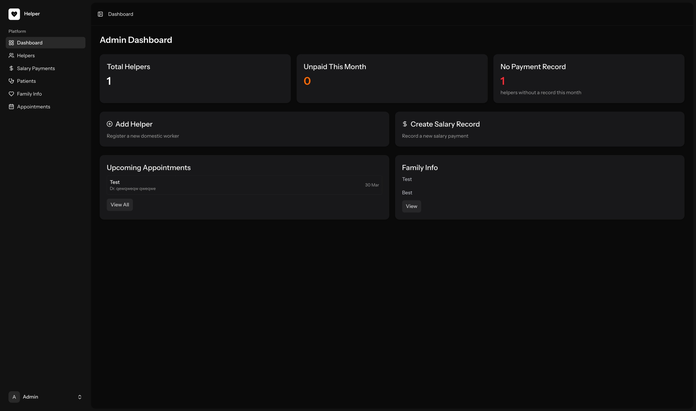
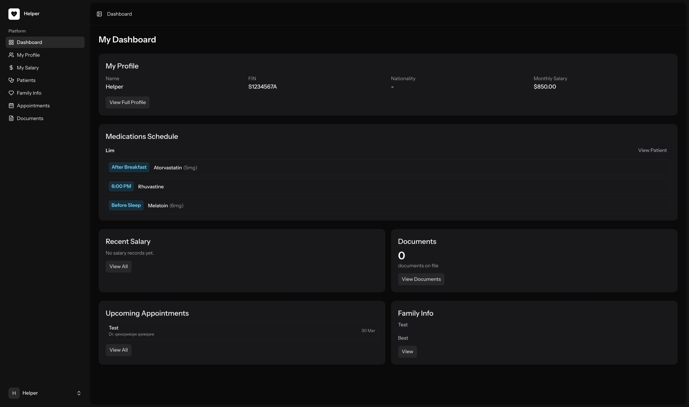
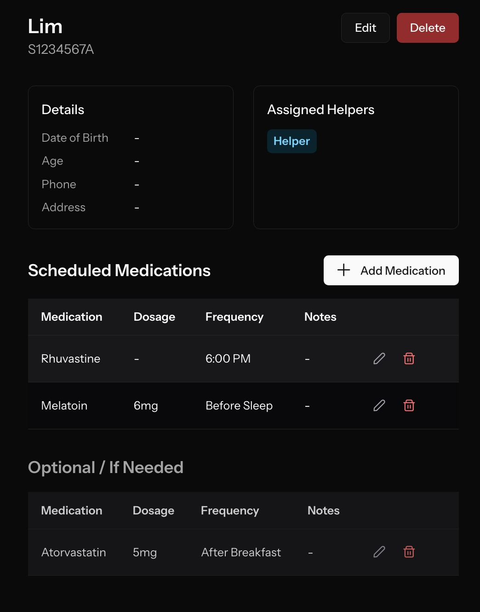
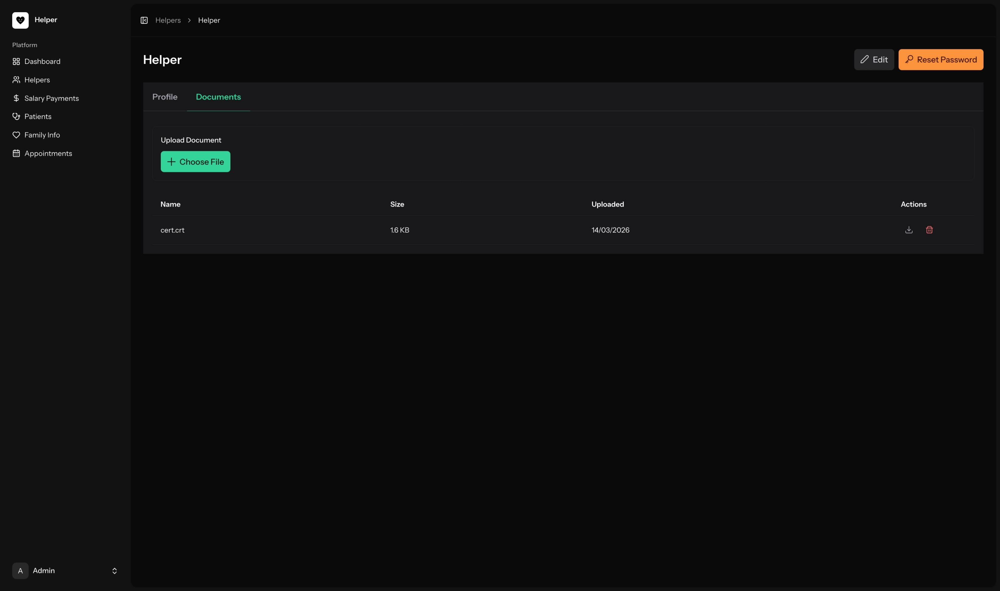
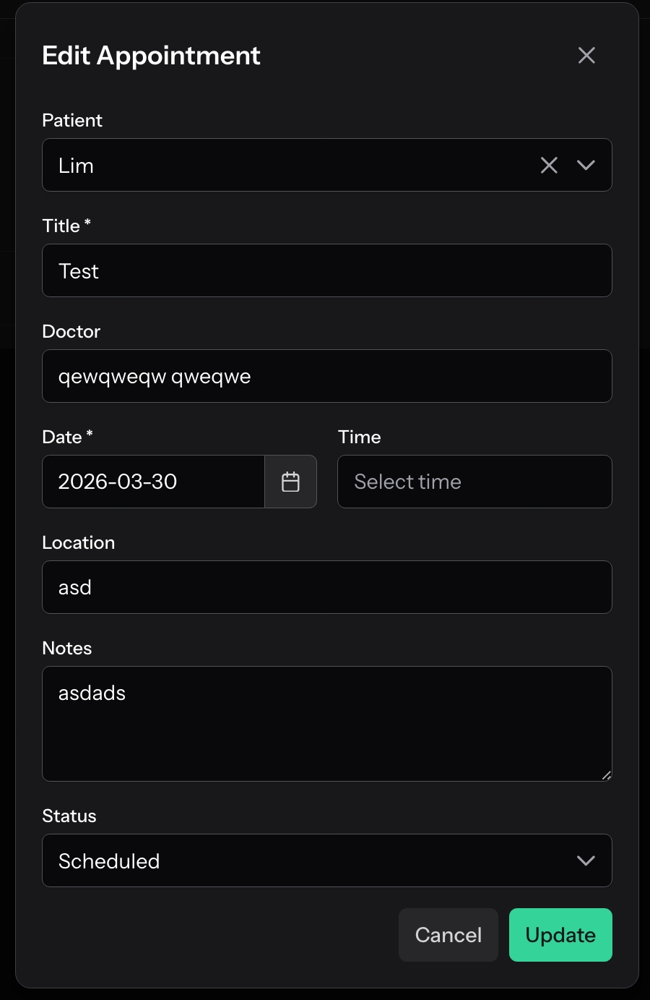
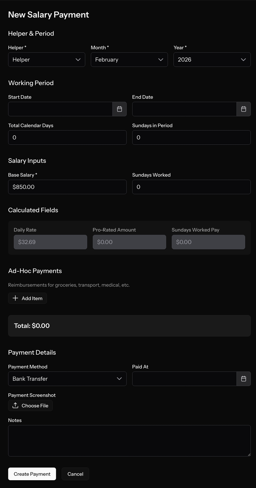

# Helper

A Laravel application for managing foreign domestic worker profiles, documents, salary, and family information.

## Deploying to Hostinger

### Prerequisites

- Hostinger shared hosting with SSH access enabled
- PHP 8.4 available at `/opt/cloudlinux/alt-php84/root/usr/bin/php`
- A MySQL database created via the Hostinger panel (note the database name, username, and password)

> **Note:** On Hostinger shared hosting, the system `php` command may not point to PHP 8.4. Use the full path `/opt/cloudlinux/alt-php84/root/usr/bin/php` for all PHP and Artisan commands throughout this guide.

### 1. Clone the Repository

SSH into your Hostinger server and clone the repo into `public_html`:

```bash
cd ~/public_html
git clone https://github.com/rawrrencee/helper.git
```

### 2. Configure `.htaccess`

Create or update `~/public_html/.htaccess` with the following rules to route all requests through Laravel:

```apacheconf
<IfModule mod_rewrite.c>
    <IfModule mod_negotiation.c>
        Options -MultiViews -Indexes
    </IfModule>

    RewriteEngine On

    # Handle Authorization Header
    RewriteCond %{HTTP:Authorization} .
    RewriteRule .* - [E=HTTP_AUTHORIZATION:%{HTTP:Authorization}]

    # Skip rewriting if already pointing to helper/public
    RewriteCond %{REQUEST_URI} ^/helper/public/
    RewriteRule ^ - [L]

    # Serve static files from helper/public if they exist (JS, CSS, images)
    RewriteCond %{DOCUMENT_ROOT}/helper/public%{REQUEST_URI} -f
    RewriteRule ^(.*)$ helper/public/$1 [L]

    # Route everything else to Laravel's index.php
    RewriteRule ^(.*)$ helper/index.php [L]
</IfModule>
```

### 3. Update `public/index.php`

Replace the contents of `~/public_html/helper/public/index.php` with the following (removes the `/../` path traversals so it works from the shared hosting directory structure):

```php
<?php

use Illuminate\Foundation\Application;
use Illuminate\Http\Request;

define('LARAVEL_START', microtime(true));

// Determine if the application is in maintenance mode...
if (file_exists($maintenance = __DIR__.'/storage/framework/maintenance.php')) {
    require $maintenance;
}

// Register the Composer autoloader...
require __DIR__.'/vendor/autoload.php';

// Bootstrap Laravel and handle the request...
/** @var Application $app */
$app = require_once __DIR__.'/bootstrap/app.php';

$app->handleRequest(Request::capture());
```

### 4. Copy `index.php` to the Project Root

Copy the same `index.php` file to `~/public_html/helper/` so the `.htaccess` rewrite target resolves correctly:

```bash
cp ~/public_html/helper/public/index.php ~/public_html/helper/index.php
```

### 5. Install Composer

If Composer is not already installed, download it:

```bash
cd ~/public_html/helper
curl -sS https://getcomposer.org/download/ -o /dev/null
/opt/cloudlinux/alt-php84/root/usr/bin/php -r "copy('https://getcomposer.org/installer', 'composer-setup.php');"
/opt/cloudlinux/alt-php84/root/usr/bin/php composer-setup.php
rm composer-setup.php
```

This creates a `composer.phar` file in the project directory.

### 6. Install Dependencies

```bash
/opt/cloudlinux/alt-php84/root/usr/bin/php ./composer.phar install --optimize-autoloader
```

### 7. Configure Environment

```bash
cp .env.example .env
```

Edit `.env` and update the following values with your Hostinger database credentials:

```dotenv
APP_URL=https://your-domain.com

DB_CONNECTION=mysql
DB_HOST=localhost
DB_PORT=3306
DB_DATABASE=your_database_name
DB_USERNAME=your_database_username
DB_PASSWORD=your_database_password
```

### 8. Generate Application Key

```bash
/opt/cloudlinux/alt-php84/root/usr/bin/php artisan key:generate
```

### 9. Run Migrations and Seed the Database

```bash
/opt/cloudlinux/alt-php84/root/usr/bin/php artisan migrate:fresh
/opt/cloudlinux/alt-php84/root/usr/bin/php artisan db:seed
```

### 10. Set Production Mode

Update `.env` to disable debug mode and set the environment to production:

```dotenv
APP_ENV=production
APP_DEBUG=false
```

### 11. Build Frontend Assets

If you haven't built the frontend assets before deploying, run this locally and commit the output, or run on the server if Node.js is available:

```bash
npm install
npm run build
```

Then push/pull the built assets (`public/build/`) to the server.

## Screenshots

### Admin Dashboard


### Helper Dashboard


### Patient Medications


### Upload Helper Files


### Edit Appointment


### Salary Payment Form

